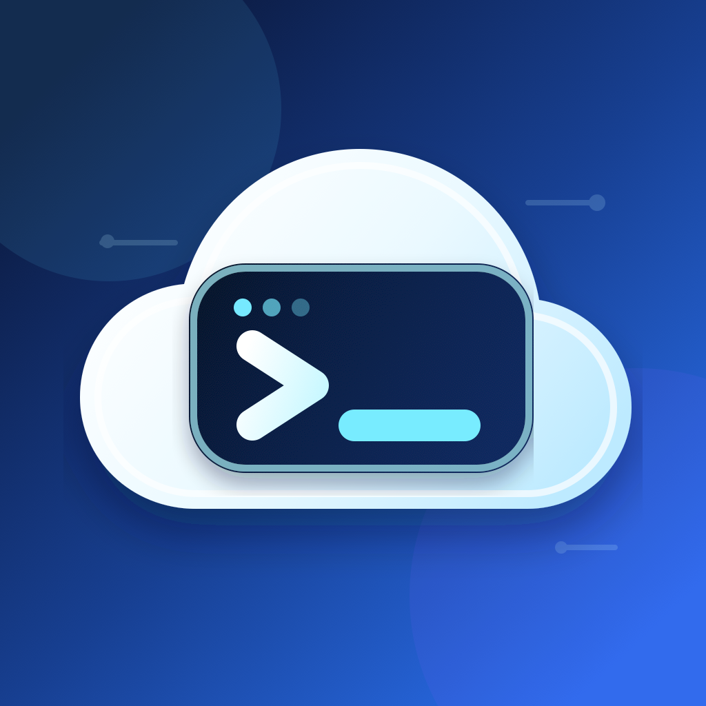
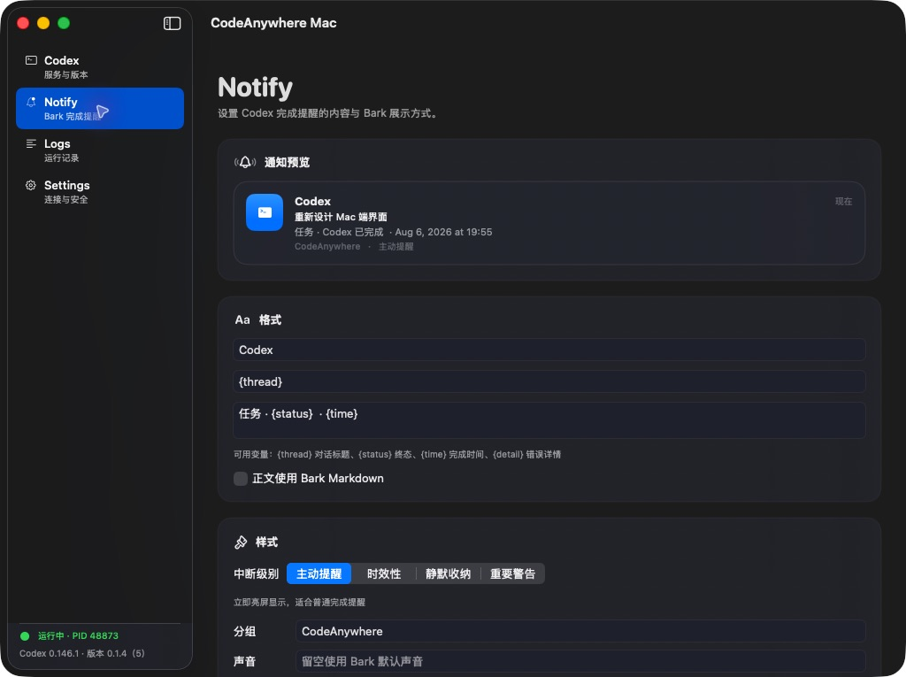
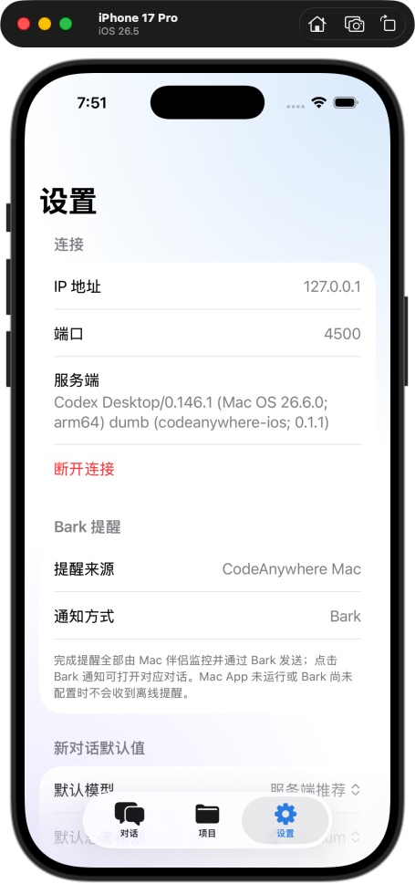
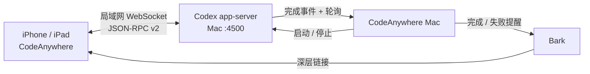

<p align="center">
  
</p>

<h1 align="center">CodeAnywhere</h1>

<p align="center">
  在 iPhone / iPad 上连接 Mac 的 Codex <code>app-server</code>，随时查看、创建并继续任务。
</p>

<p align="center">
  <a href="../../releases/latest">下载 macOS 版</a> ·
  <a href="#快速开始">快速开始</a> ·
  <a href="#从源码构建">从源码构建</a>
</p>

> [!WARNING]
> 仅在你控制的可信局域网中使用。移动端会以 Full Access 和 `approvalPolicy: never` 发起任务，并自动接受服务端命令/文件审批。

CodeAnywhere 由两个原生 SwiftUI App 配合工作：

| App | 用途 | 要求 |
| --- | --- | --- |
| **CodeAnywhere** | iOS / iPadOS 对话、项目、模型与思考级别控制 | iOS 18+ |
| **CodeAnywhere Mac** | 启停 Codex、展示连接信息、发送 Bark 完成提醒 | macOS 15+ |

## 界面预览

<table>
  <tr>
    <td width="60%"></td>
    <td width="40%"></td>
  </tr>
  <tr>
    <td align="center">Mac：预览并配置 Bark 完成提醒</td>
    <td align="center">iPhone：连接状态与默认模型设置</td>
  </tr>
</table>

## 快速开始

### 1. 安装 Mac App

从 [GitHub Releases](../../releases/latest) 下载 `CodeAnywhere-0.1.4-macOS-universal.dmg`，打开后将 **CodeAnywhere Mac** 拖入 `Applications`。

### 2. 启动服务

打开 Mac App，在 **Codex** 页面点击“启动服务器”，记下显示的局域网地址和端口。默认端口为 `4500`。

### 3. 连接 iPhone / iPad

在移动端填写 Mac 的局域网地址与相同端口。连接后即可：

- 查看、搜索并继续历史对话
- 选择项目、模型和思考级别创建任务
- 实时查看回答、reasoning、命令与文件变更

### 4. 开启 Bark 提醒（可选）

在 Mac App 的 **Settings** 中保存 Bark Server 与 Device Key，再到 **Notify** 调整模板、分组和声音。

提醒只针对 **已完成** 和 **执行失败** 的 Turn；手动中断不会发送。点击 Bark 通知可通过深层链接打开对应对话：

```text
codeanywhere://thread/<thread-id>
```

Device Key 仅保存于 macOS Keychain。界面中的“已接受”只代表 Bark Server 返回 HTTP 成功且业务 `code` 为 `200`，不代表 iPhone 一定已经展示通知。

## 主要能力

| 移动端 | Mac 端 |
| --- | --- |
| 历史会话、项目与新对话 | 管理本 App 启动的 Codex 进程 |
| 服务端模型与思考级别 | 展示 CLI、端口和运行状态 |
| Markdown、表格、代码与图片 | 事件监听 + 轮询回退 |
| 流式回答、命令和文件变更 | Turn ID 去重、有限重试、持久化记录 |
| 系统 / 浅色 / 深色外观 | 菜单栏快捷操作与 Bark 预览 |

## 工作方式



Mac App 只管理自己启动的 Codex 进程，不会接管终端或旧脚本启动的外部进程。

## 从源码构建

需要 Xcode 26+ 和 [XcodeGen](https://github.com/yonaskolb/XcodeGen)。`project.yml` 是工程配置源文件；修改配置后请重新生成工程，不要手改 `project.pbxproj`。

```bash
xcodegen generate
open CodeAnywhere.xcodeproj
```

运行测试：

```bash
# macOS
xcodebuild test \
  -project CodeAnywhere.xcodeproj \
  -scheme CodeAnywhereMac \
  -destination 'platform=macOS,arch=arm64'

# iOS Simulator（设备名可按本机环境替换）
xcodebuild test \
  -project CodeAnywhere.xcodeproj \
  -scheme CodeAnywhere \
  -destination 'platform=iOS Simulator,name=iPhone 17 Pro'
```

构建 Mac Release：

```bash
xcodebuild build \
  -project CodeAnywhere.xcodeproj \
  -scheme CodeAnywhereMac \
  -configuration Release \
  -destination 'generic/platform=macOS'
```

## 版本与发布

- macOS：`0.1.4 (5)`，Universal `arm64 + x86_64` DMG
- iOS / iPadOS：源码版本 `0.1.3 (5)`；可用构建以 TestFlight 中显示为准
- 正式产物需通过 Developer ID 签名、Apple Notarization、Staple 与 Gatekeeper 校验
- 下载与 SHA-256 以 [GitHub Releases](../../releases) 为准

## 项目结构

```text
Sources/      iOS / iPadOS App 与 app-server 客户端
SourcesMac/   macOS 控制台、进程与通知监控
Tests*/       iOS 与 macOS 单元测试
Resources/    Asset catalog、AppIcon 与隐私资源
project.yml   XcodeGen 工程配置源
docs/         协议、设计与 README 图片
```

## 许可与反馈

仓库暂未包含 `LICENSE`，因此默认不授予复制、修改或再分发权。问题与建议请提交到 [GitHub Issues](../../issues)，附上系统与 App 版本，并先移除 IP、Token、Device Key 等敏感信息。
