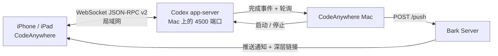

# CodeAnywhere

CodeAnywhere 是一个 SwiftUI 编写的 Codex 局域网客户端：用 iPhone 或 iPad 连接 Mac 上的 Codex `app-server`，查看历史会话、创建项目、继续任务，并在 Mac 端监控任务完成状态。

它由两个互相配合的应用组成：

- **CodeAnywhere（iOS/iPadOS）**：移动端对话控制台，支持会话、项目、模型和 reasoning effort 管理。
- **CodeAnywhere Mac（macOS）**：局域网服务器控制台，负责启动/停止 Codex、监控完成事件，并可通过 Bark 发送离线提醒。

> 当前 macOS 归档同时包含 Apple Silicon 与 Intel 架构，最低支持 macOS 15；移动端最低支持 iOS 18。iOS 版本通过 TestFlight 分发，macOS 版本通过 GitHub Releases 提供 DMG。

## 安全边界

CodeAnywhere 将移动端请求转发到同一局域网内的 Mac。连接前请确认网络可信，并理解以下权限边界：

- iOS 发起的会话使用 Codex Full Access 与 `approvalPolicy: never`，服务端审批请求会自动接受。
- 这意味着 Codex 可以读写 Mac 工作区之外的文件并执行命令；请只连接你本人控制的 Mac。
- Mac 端的 Bark Device Key 只保存到 macOS Keychain，不写入项目、UserDefaults、URL 或日志。
- 通知中的“已接受”表示 Bark Server 返回成功（HTTP 成功且业务 `code` 为 `200`），不等于 iPhone 已实际显示通知。

## 工作方式



## 安装

### macOS

从 [GitHub Releases](../../releases/latest) 下载 `CodeAnywhere-0.1.3-macOS-universal.dmg`，打开磁盘映像后将 **CodeAnywhere Mac** 拖入 `Applications`。

首次启动后，在 Mac App 中确认监听端口；然后在 iPhone/iPad 的连接设置中填写这台 Mac 的局域网地址和相同端口。默认端口是 `4500`，也可以在 Mac App 中调整。

### iOS / iPadOS

在 TestFlight 中安装 **CodeAnywhere**。打开应用后填写 Mac 的局域网地址、端口和访问配置，然后连接服务器。

## 快速开始

### 1. 启动 Mac 端

打开 **CodeAnywhere Mac**，确认本机网络地址和端口，点击“启动服务器”。Mac App 只管理自己启动的 Codex 进程；它不会接管由旧脚本或其他终端启动的外部进程。

### 2. 连接移动端

在 CodeAnywhere 的连接设置中填写：

| 配置 | 说明 |
| --- | --- |
| Mac 地址 | Mac 在当前局域网中的 IP 地址或可解析主机名 |
| 端口 | 与 Mac App 相同，默认 `4500` |
| 访问配置 | 使用 Mac App 显示的服务端访问配置 |

连接成功后，可以读取历史 Session、新建项目和对话、继续已归档会话，并查看流式回答、reasoning、命令和文件变更。

### 3. 配置完成提醒（可选）

在 Mac App 中填写 Bark Server URL 和 Device Key。任务完成、失败或中断时，Mac 端监控器会发送带对话深层链接的 JSON 通知。点击通知会打开：

```text
codeanywhere://thread/<thread-id>
```

## 功能

### iOS / iPadOS

- 连接同一局域网内的 Codex `app-server`。
- 分页查看非归档历史会话，并读取完整消息。
- 新建项目、创建会话、继续历史会话。
- 动态读取服务端模型和 reasoning effort 选项。
- 流式渲染回答、reasoning、命令输出和文件变更。
- 支持 Markdown、表格、代码块、链接和图片。
- 支持系统、浅色和深色外观；兼容 Liquid Glass，旧系统自动降级为 Material。
- 通过 `codeanywhere://thread/...` 深层链接打开指定对话。

### macOS

- 启动和停止由 Mac App 管理的 Codex `app-server`。
- 展示服务器状态、网络地址和连接信息。
- 监听 `turn/completed`，并以轮询作为可靠性回退。
- 持久化通知历史，按 Turn ID 去重，并限制 Bark 重试次数。
- 通过菜单栏快速打开主界面、启动/停止服务器和退出应用。

## 从源码构建

### 环境要求

- macOS 15 或更高版本
- Xcode 26 或更高版本
- Swift 5 语言模式（由 XcodeGen 配置）
- [XcodeGen](https://github.com/yonaskolb/XcodeGen)

### 生成 Xcode 工程

```bash
xcodegen generate
open CodeAnywhere.xcodeproj
```

`project.yml` 是项目结构和版本设置的源文件。修改项目配置后请重新运行 `xcodegen generate`，不要手动编辑 `CodeAnywhere.xcodeproj/project.pbxproj`。

### 本地运行

```bash
# iOS 模拟器
xcodebuild test \
  -project CodeAnywhere.xcodeproj \
  -scheme CodeAnywhere \
  -destination 'platform=iOS Simulator,name=iPhone 17 Pro'

# macOS
xcodebuild test \
  -project CodeAnywhere.xcodeproj \
  -scheme CodeAnywhereMac \
  -destination 'platform=macOS,arch=arm64'
```

### 构建 macOS Release

```bash
xcodebuild build \
  -project CodeAnywhere.xcodeproj \
  -scheme CodeAnywhereMac \
  -configuration Release \
  -destination 'platform=macOS,arch=arm64'
```

## 发布

正式发布流程包括：

1. 在 `project.yml` 中更新 `MARKETING_VERSION` 和 `CURRENT_PROJECT_VERSION`。
2. 运行 `xcodegen generate`。
3. 运行 iOS/macOS 测试。
4. 归档并签名 macOS App，制作 DMG。
5. 对 macOS 分发包进行 notarization 和 Gatekeeper 校验。
6. 使用 `gh release create` 发布 Git tag 与 DMG。

当前发布资产和校验信息以 [GitHub Releases](../../releases) 为准。每个 DMG 都应同时提供 SHA-256 校验值。

## 项目结构

```text
Sources/       iOS / iPadOS 应用与 app-server 客户端
SourcesMac/    macOS 控制台、服务器进程和通知监控
Tests/         iOS 单元测试
TestsMac/      macOS 单元测试
Resources/     Asset catalog、AppIcon 和隐私资源
project.yml    XcodeGen 项目源配置
docs/          设计与协议说明
```

## 许可证

当前仓库尚未包含 `LICENSE` 文件。在正式添加许可证之前，源代码默认不授予第三方复制、修改或再分发权。

## 反馈与贡献

欢迎通过 [GitHub Issues](../../issues) 报告问题或提出建议。提交问题时请包含：

- macOS / iOS 版本和设备型号
- CodeAnywhere 版本与构建号
- 是否使用局域网、VPN 或代理
- 相关日志中的错误信息（请先移除 IP、Token、Device Key 和其他敏感信息）
